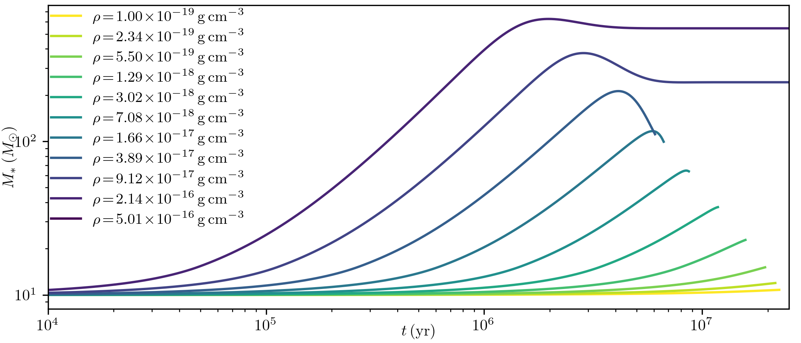
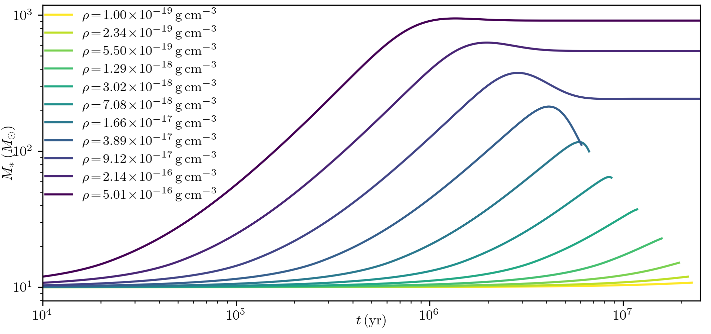
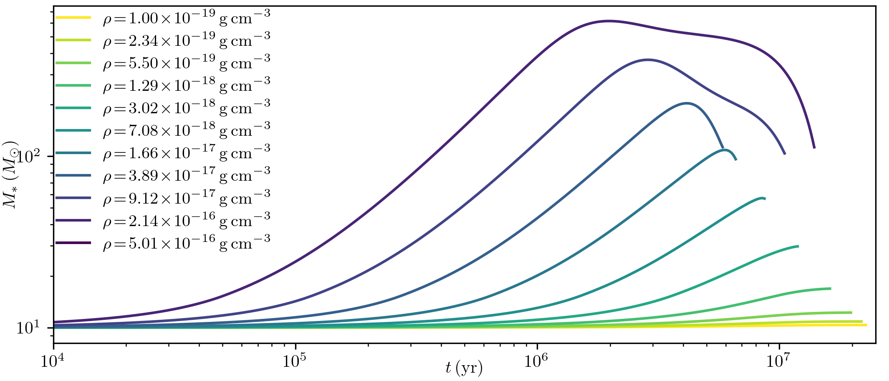
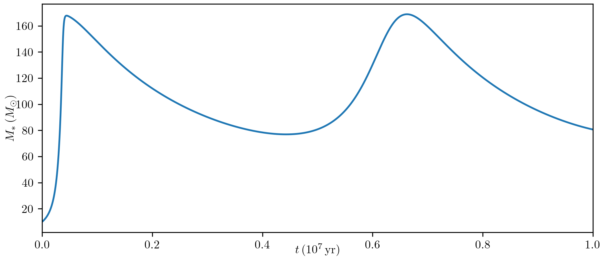

# starsam examples
`tidal_base.py` calculates a grid of models, varying the ambinet density.

`tidal_tkh.py` illustrates how to modify the `base` calculation by using a different definition of the Kelvin-Helmholtz timescale when checking whether runaway accretion occurs.

`tidal_tdep.py` illustrates how to modify the `base` calculation by using a time-dependent ambient density. 

`nbody.py` illustrates how to combine a stellar evolution claculation using this package with an N-body calculation, following the evolution of a star on an eccentric orbit through a simple model of an AGN disk.

# Example Results
First, the results of a basic survey, tracks of stellar mass vs time. In these simulations, each star accretes from a constant density environment. One of the simulations actually satisfies the default criterion for runaway accretion at the beginning of the simulation, and is not shown. 

This example shows the same simulations as above, except it uses a different formula for the Kelvin-Helmholtz, in this case the expression for an n=1 polytrope. 

This example shows similar calculations to the first case, except the ambient density begins to decline at about 5 Myrs, reaching zero by 15 Myrs.

Finally, here is an example from an Nbody + stellar evolution calculation. This assumed a disk with a constant sound speed and power-law density, and followed an (initially) 10 solar-mass star on an eccentric orbit through the disk.

